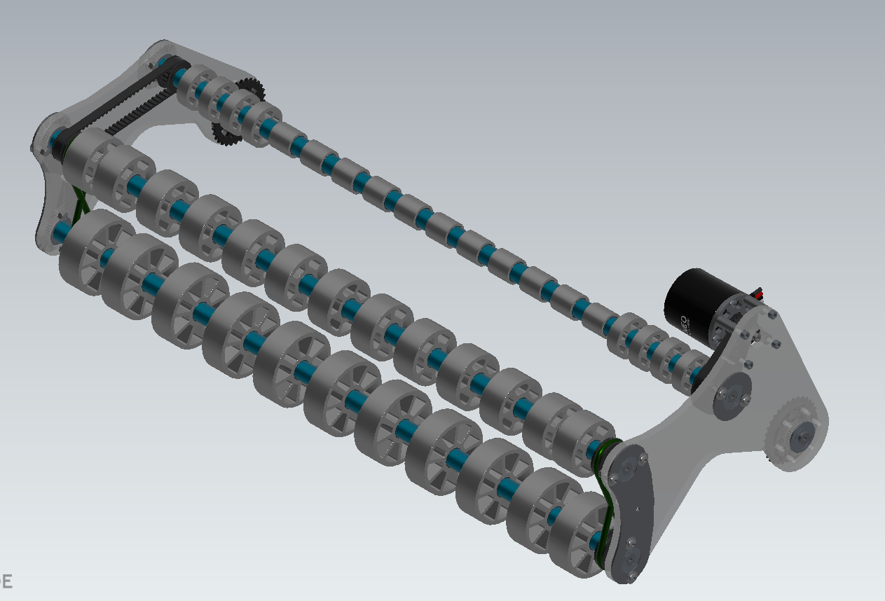

# Robot Parts
 - model.glb is the chassis + gearboxes
    
 - model0.glb is the intake
    
 - model1.glb is the first stage of the elevator
   
 - model2.glb is the second stage of the elevator
   
 - model3.glb is the wrist + gripper
   
 - model4.glb is the shooter
   