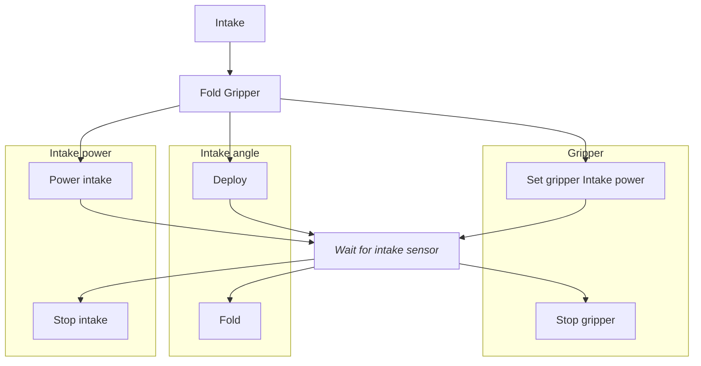
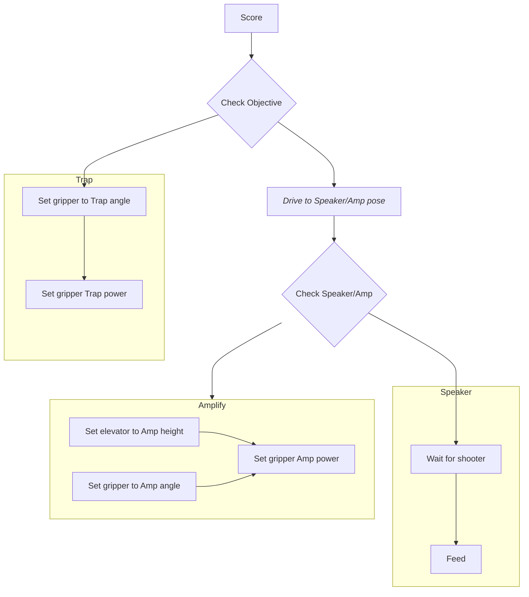

# Command groups
This file contains [Mermaid](https://mermaid.js.org/) graphs that show the command groups used on the robot. <i>Italicized nodes</i> can be overridden. Information about specific subsystems can be found in their respective directories.

## Intake

## Score

